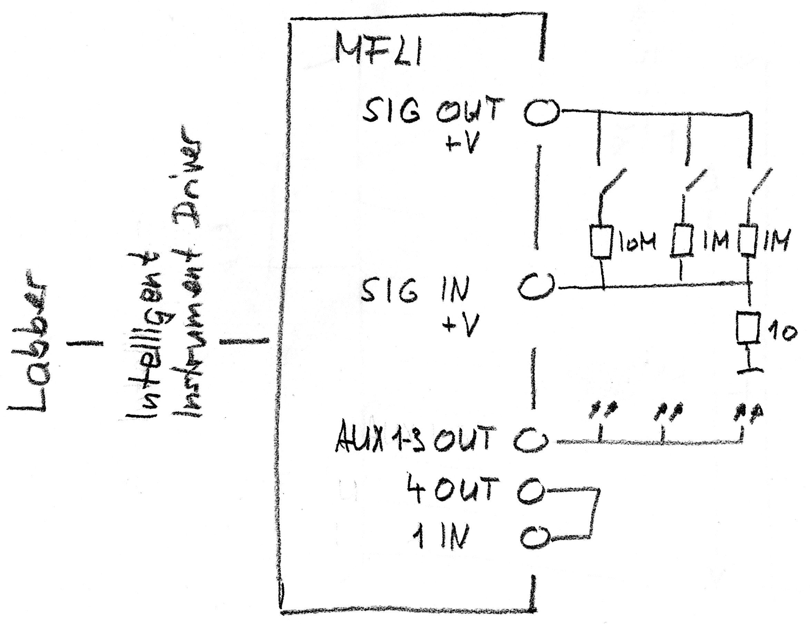

# mfli_labber_dynamic_integration

Zurich Instruments MFLI and Labber using dynamic integration time to accelerate measurements

## Directory structure

- auxiliary: Additional information and files which is somehow needed but not important
- `configuration`: The configuration of the Labber `Instrument Server` and `Measurements Editor` used with the testbox
- `Drivers`: Labber drivers written for this study
  - `python_libs`: The libraries for linux and windows. Would better use pip - but I did't find out how to use it with labber
  - `ZI_SimpleGeneralGenerator`: Used for looping. Based on the labber sample `SimpleGeneralGenerator`
  - `ZI_MFLI_Lockin`: The Labber driver written for this study

## Testsetup

Signal --> System --> Lockin amplifier --> measurement criterion

The `system` will be eventually experiments at nanophysics@eth. The `system` for this study is the `testbox` in the foto below. The lockin amplifier is the blue MFLI.


The setup used. In the middle the lockin amplifier an to the right tye `system` implemented using a voltage devider and Photorelays.



### Software


Zurich Instruments MFLI --> Intelligent Drive using Zurich Instruments Python API (written for this study) --> Labber Instrument Driver (written for this study) -> Labber Instrument Server --> Labber Measurements Editor

## Features

### System

The system simulates a typical situation: Low signal, but somewhere a high signal. The system is implemented in the `testbox` which fits nicely on a desk.


The system is controlled by a labber driver where three behaviours may be selected `peak`, `horn` and `step`.


### Intelligent Driver

The lockin amplifier measures constantly using 30Hz. The `Intelligent Driver` optimizes the measering time. Where the signal is not interessting, the measurement is aborted after 1 sample, if there is some interesting peak, a measurement may use 30 samples. This is a weigh up between accurency and measuring speed.

This is the implementation of a criterion

``` Python
class CriterionSimple(CriterionBase):
    def satisfied(self):
        '''
          return False if we require more samples
          return True if sufficient data is available
        '''
        self.x_V = self.values_X.get_median(skip=2) # empirisch from the step response: The first two samples are wrong
        self.y_V = self.values_Y.get_median(skip=2)
        if self.x_V < 2e-6:
            # The signal is small
            # success
            if self.get_count() >= 1:
                # success
                return True
        if self.x_V < 4e-6:
            # The signal is medium
            if self.get_count() >= 6:
                # success
                return True
        if self.get_count() >= 20:
            # success
            return True
        # We need more samples
        return False
```

Above code will be called after every Lockin sample. It does the following:

- If the signal is smaller than 2e-6 V only 1 sample is required
- If the signal is smaller than 4e-6 V 6 samples are required
- At most 20 samples are collected.

The returned X and Y values are the median of the collected samples. The first two samples are thrown away (empirically determined settle time)


Above image shows a measurement with this intelligent logic: Small signals are scattered but high values are exact. The time improvement is a factor of 10.


Above image shows a measurment the conventional way taking always 10 samples. Note that small signals are measured with higher accuracy (the data which is not interesting), but the interesting higher signales are still measured with 10 samples, which is less then crierium before which used 20 samples.

## TODO

- Document Sources
- Feature List
- User Guide
- Testenvironment for criterion